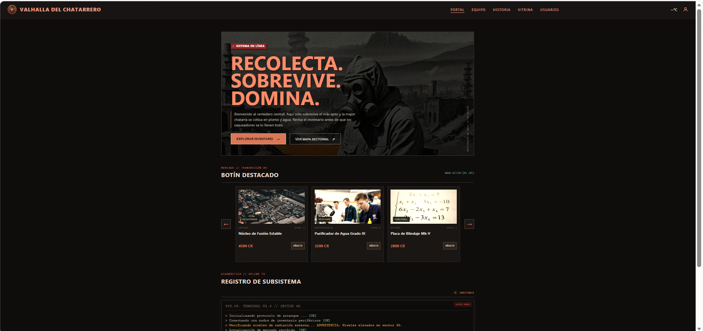
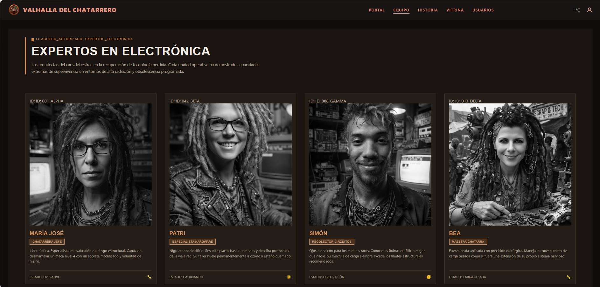
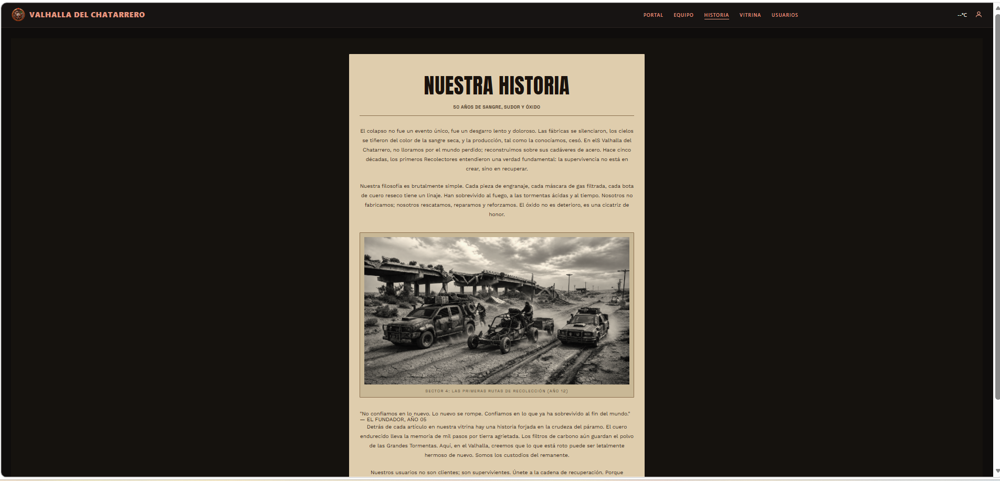
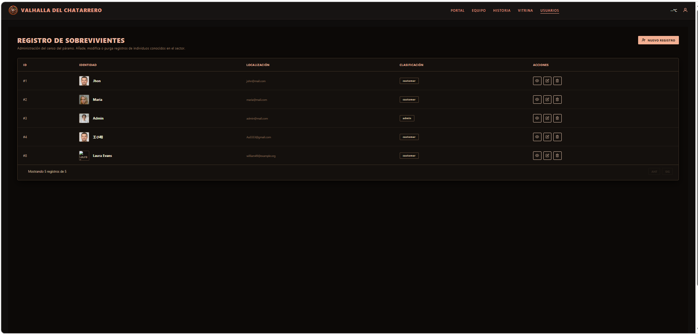

# 🛡️ Valhalla del Chatarrero - E-commerce Post-Apocalíptico

<div align="center">
  
</div>

Bienvenido a **Valhalla del Chatarrero**, una plataforma de comercio electrónico inmersiva ambientada en un páramo desolado y peligroso. Este proyecto no es solo una tienda; es una experiencia narrativa donde los usuarios, o "sobrevivientes", interactúan con un inventario de tecnología recuperada y un registro de otros habitantes del sector.

---

## 🌟 Características Principales

*   **Temática Post-Apocalíptica:** Diseño visual oscuro, tipografía industrial y una paleta de colores quemados que sumergen al usuario en el páramo.

*   **Navegación Intuitiva:** La aplicación cuenta con 4 páginas principales accesibles a través de una barra de navegación estilo terminal:

    *   **Portal (Inicio):** Resumen del sector y los 5 objetos más valiosos a la venta.
    *   **Equipo:** Conoce a los expertos que hacen posible el Valhalla.
    *   **Historia:** Adéntrate en el lore del páramo y la fundación de la comunidad.
    *   **Vitrina (Productos):** Catálogo completo de chatarra recuperada.
    *   **Usuarios:** Registro y gestión de los sobrevivientes del sector.

*   **Integración de APIs:**
    *   **API de Productos:** Muestra dinámicamente artículos únicos con sus precios.
    *   **API de Usuarios:** Permite visualizar y administrar la base de datos de habitantes del páramo.

---
## 📸 Galería de Páginas

A continuación, se muestra un recorrido visual por las secciones de la aplicación:

| **1. Portal (Inicio)** | **2. Equipo** |
| :---: | :---: |
|  |  |
| *Vista principal con el llamado a la acción y los objetos destacados.* | *Perfil detallado de los colaboradores del Valhalla.* |

| **3. Nuestra Historia** | **4. Registro de Sobrevivientes** |
| :---: | :---: |
|  |  |
| *Narrativa inmersiva sobre el colapso y los primeros recolectores.* | *Tabla interactiva de los usuarios registrados en el sector.* |

---

## 🛠️ Tecnologías y Herramientas de Desarrollo

Este proyecto ha sido posible gracias al uso de un conjunto moderno y profesional de tecnologías y metodologías de desarrollo:


[]
[]


---
## 🔗 Enlaces del Proyecto

Accede a los recursos clave, despliegues y tableros de gestión de **Valhalla del Chatarrero**:

[](https://valhalla-del-chatarrero.vercel.app/)
[](https://github.com/simonlopez25/valhalla-del-chatarrero.git)
[](https://www.figma.com/design/YYE8czAPCxSpbQGDRNjNHx/valhalla-del-chatarrero?node-id=0-1&t=7cRwSKKT5J3AfcUv-0)
[](https://simonlopezsaldarroaga.atlassian.net/jira/software/projects/VDC/boards/34/backlog)

---

## 👥 Equipo de Valhalla (Colaboradores)

Este proyecto fue forjado por un equipo de 8 sobrevivientes. ¡Conéctate con ellos a través de sus perfiles!

* **Simon Lopez** - *Frontend Developer*  
  [](www.linkedin.com/in/simon-lopez-a478bb235)
  [](https://github.com/simonlopez25)

* **Beatriz Iñiguez** - *Frontend Developer*  
  []()
  [](https://github.com/Beatriz484)

* **Jhojann Sossa** - *Frontend Developer*  
  [](https://www.linkedin.com/in/jhojann-sossa-009b25121)
  [](https://github.com/jhojannsossa)

* **Patricia Diaz** - *Frontend Developer*  
  []( https://www.linkedin.com/in/patriciaapariciodiaz)
  [](https://github.com/apariciodiazpatricia-cell)

* **Jose Loero NieleZ** - *Frontend Developer*  
  []()
  []()

* **Margarita Bellido** - *Frontend Developer*  
  []()
  [](https://github.com/margaritabellidoroig)

* **Wilfredy Salcedo** - *Frontend Developer*  
  []()
  [](https://github.com/Willfredy742)

* **Maria Jose Rodriguez** - *Frontend Developer*  
  [](https://www.linkedin.com/in/maria-jose-rodriguez-ramos)
  [](https://github.com/mjrr39sevilla)

---

## 📁 Carpeteo y Estructura

Se ha implementado una estructura de carpetas limpia y escalable para facilitar el mantenimiento y la colaboración:

```text
valhalla-del-chatarrero/
├── public/            # Archivos estáticos (imágenes, favicon, etc.)
├── src/               # Código fuente de la aplicación
│   ├── assets/        # Imágenes, iconos y recursos visuales
│   ├── components/    # Componentes reutilizables (Navbar, Card, Table, etc.)
│   ├── pages/         # Páginas principales de la aplicación (Home, Equipo, Historia, Productos, Usuarios)
│   ├── style/         # Hojas de estilo global y módulos CSS
│   ├── App.jsx        # Componente raíz
│   └── main.jsx       # Punto de entrada de la aplicación
├── .gitignore         # Archivos a ignorar por Git
├── package.json       # Dependencias y scripts del proyecto
├── README.md          # Documentación del proyecto
└── vite.config.js     # Configuración de Vite


